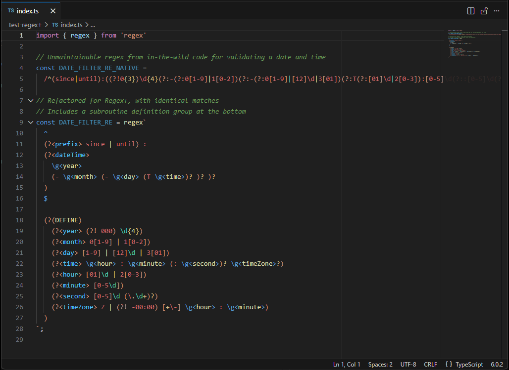
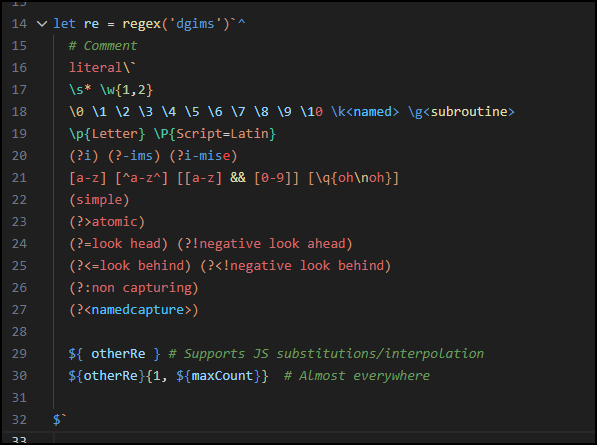

# Regex+

Visual Studio Code syntax highlighter for [Steve Levithan's Regex+ library](https://github.com/slevithan/regex), _"a template tag for readable, high-performance, native JS regexes with extended syntax, context-aware interpolation, and always-on best practices"_.

<p>&nbsp;</p>


<p>&nbsp;</p>

----

<p>&nbsp;</p>




## Usage
This extension highlights Regex+ template strings in JavaScript and TypeScript source files, including their React flavours.

You can also create and edit `.regex+` files, their full text is considered a regular expression source. This may help in writing very complex expressions that you can later copy and paste in your JS/TS code (or even read from disk then feed to Regex+).

Be sure to [read the docs](https://github.com/slevithan/regex#readme) if you're not familiar with Regex+.

Regex+ is an astonishing piece of software. I highly recommend it if you want to be serious about regexes.




## Configuration
None yet.


## Known Issues

Although the full regular expression syntax Regex+ brings is supported, not all its features are yet implemented.

For now, the following restrictions apply:

- Only the `regex`, `regex(flags)` and `pattern` tagged templates are highlighted. The `regex(options)` variant and the `rewrite` utility function are not.
    - To call `regex` with options and still have your regex syntax highlighted, either make it start with `#regex` or `#rx`, or prefix the actual template with `/* regex */`:

    ```js
    // With embedded start comment:
    const re = regex(options)`#rx
    ...
    `

    // With prefix comment:
    const re = regex(options)/* regex */`
    ...
    `
    ```

- Only the main Regex+ package is supported. The additional syntax brought by [the recursion plugin](https://github.com/slevithan/regex-recursion) (`(?R=N)`, `\g<name&R=N>` and `\g<number&R=N>`) is not.
- You cannot alias the imports, they have to be named `regex` and `pattern`.
    - This is a limitation of the TextMate engine VS Code uses to syntax highlight code. If you really want to alias the functions (e.g., `import { regex as regexplus } from 'regex'`), you can still use the comment trick described above.

Work is still in progress and the missing features will be implemented gradually.


## Acknowledgements

This project wouldn't have been possible without the help and support from the following people:
* [@slevithan](https://github.com/slevithan) - Author of Regex+
* [@RedCMD](https://github.com/RedCMD) - TextMate guru

Thanks, guys!
